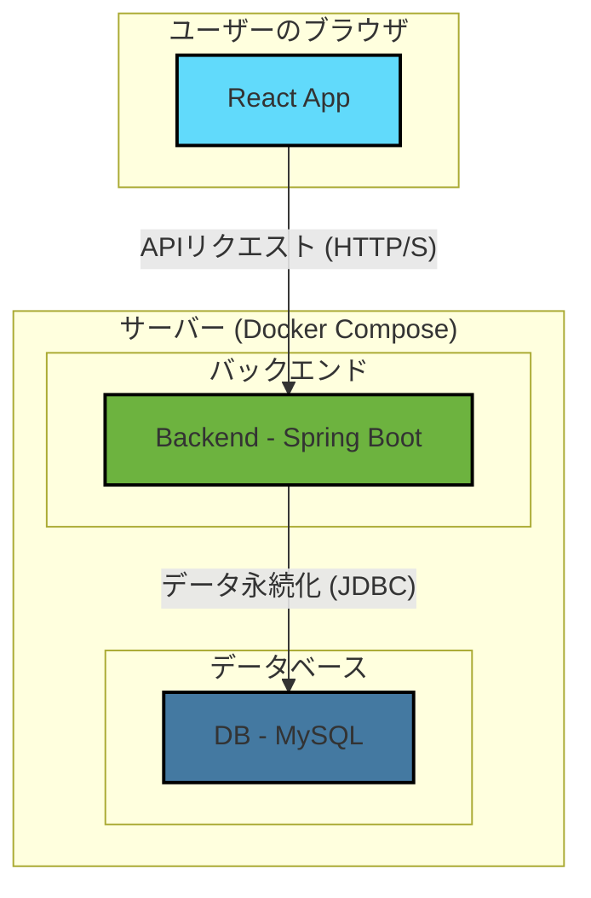

# 経済指標・ボラティリティ分析システム (Economic Indicators Analysis System)

[](https://www.google.com/search?q=https://github.com/somadevfat/economicindicators-java/actions/workflows/ci.yml)

## 概要

本プロジェクトは、外国為替市場（FX）の経済指標発表と市場のボラティリティ（価格変動の激しさ）を分析し、**「取引のリスク」を可視化・判定するWebアプリケーション**です。

従来は手作業や感覚に頼りがちだった「指標発表前後の市場は荒れそうか？」という判断を、過去5年分の統計データに基づいて自動で分析・評価します。これにより、トレーダーがより客観的な情報に基づいた意思決定を行えるよう支援することを目的としています。

-----

## 背景と目的

このプロジェクトは、バックエンドエンジニアとしてのスキルセットを実証するために開発したポートフォリオです。以下の2つの主要な課題を解決することを目的としています。

1.  **手動分析の自動化**: MT5（MetaTrader 5）から出力される経済指標カレンダーと、カスタムインジケーター（ZigZag）によるボラティリティデータをシステムにインポートし、指標とボラティリティの関連付けから統計分析までを完全に自動化します。
2.  **リスクの可視化**: 分析結果を「地合い分類（大・中・小）」や「地合い判定（強気・普通・弱気）」といった直感的な指標で表示し、トレーダーが一目で市場のリスクを把握できるようにします。

-----

## 主な機能

### ユーザー向け機能

  * **分析サマリー表示**: 各経済指標に対して、以下の分析結果を一覧で表示します。
      * **地合い分類**: 過去5年間の同時間帯の平均ボラティリティと比較し、現在の市場が「大」「中」「小」のいずれの状態にあるかを分類します。
      * **地合い判定**: 指標の「実績」「市場予想」「前回値」を比較分析し、市場センチメントを「強気」「普通」「弱気」で判定します。
      * **直近の実績**: 比較対象として、直近2回分の指標結果と、その際のボラティリティを表示します。

### 管理者向け機能

  * **データインポート**: 経済指標とボラティリティのJSONデータを一括でインポートできます。
      * UTCで提供される時刻データをJST（日本標準時）へ自動変換します。
      * 発表時刻に基づいて、経済指標とボラティリティデータを自動で紐付けます。
  * **データ管理**: インポートした経済指標やボラティリティデータのCRUD（作成・読み取り・更新・削除）操作が可能です。
  * **統計再計算**: 最新のデータに基づいて、統計分析（平均ボラティリティ計算など）を再実行するトリガー機能。

-----

## アーキテクチャ

本システムは、バックエンド、フロントエンド、データベースをそれぞれDockerコンテナで構成し、Docker Composeによって一元管理されています。



-----

## 技術スタック

本プロジェクトでは、モダンで堅牢な技術スタックを選定しています。

| カテゴリ | 技術 | 目的・選定理由 |
| :--- | :--- | :--- |
| **バックエンド** | **Java 17, Spring Boot 3.x** | 堅牢なエンタープライズアプリケーション開発の実績と豊富なエコシステム。 |
| | **Spring Data JPA** | オブジェクト指向での効率的なデータベースアクセス。 |
| | **Spring Security** | 柔軟かつ強力な認証・認可機能の実装。 |
| | **Spring Batch** | 5年分の履歴データなど、大量データのインポート処理を効率的かつ堅牢に実行するため。 |
| | **Maven** | 依存関係管理とプロジェクトビルド。 |
| **フロントエンド** | **React, TypeScript** | コンポーネントベースでの効率的なUI開発と、静的型付けによるコードの品質向上。 |
| | **TanStack Query (React Query)** | APIからのデータ取得（サーバー状態）を効率的に管理（キャッシュ、非同期処理など）。 |
| | **Zustand** | UIの状態（クライアント状態）をシンプルに管理。 |
| **データベース** | **MySQL 8.0** | 信頼性の高いオープンソースのリレーショナルデータベース。 |
| **インフラ** | **Docker, Docker Compose** | 環境差異をなくし、開発から本番まで一貫した環境を容易に構築・管理するため。 |
| **CI/CD** | **GitHub Actions** | master/developブランチへのpush/pull\_requestをトリガーに、ビルドとテストを自動実行。 |
| **API仕様** | **OpenAPI (Springdoc)** | API仕様の自動生成と、Swagger UIによるインタラクティブなドキュメント提供。 |
| **テスト** | **JUnit 5, Mockito** | ビジネスロジックの単体テスト。 |
| | **Spring Boot Test** | DB接続を含めたAPIエンドポイントの結合テスト。 |

-----

## こだわった点・アピールポイント

### 1\. 設計思想に基づいた開発

本プロジェクトは、場当たり的な実装ではなく、明確な設計思想を持って開発を進めています。クリエイティブフェーズを設け、各要素の最適なアプローチを比較検討しました。

  * **API設計**: RESTの原則に準拠したリソースベースのAPIを設計し、予測可能性と再利用性を高めました。
  * **データベース設計**: 正規化を意識しつつ、検索パフォーマンスを向上させるための適切なインデックスを設計しました。
  * **大量データ処理**: 5年分の履歴データインポートを想定し、逐次処理ではなくSpring Batchを用いたチャンクベースの堅牢なバッチ処理方式を採用しました。
  * **フロントエンド状態管理**: API通信から得られる「サーバー状態」とUIの「クライアント状態」を明確に分離する戦略（TanStack Query + Zustand）を採用し、複雑化しやすいフロントエンドのコードをクリーンに保つ工夫をしています。

### 2\. 独自の分析アルゴリズム

本システムの中核となる分析ロジックは、独自にアルゴリズムを設計・実装しました。

  * **地合い分類アルゴリズム**: 単純な固定閾値ではなく、過去データの\*\*平均値と標準偏差(σ)\*\*を用いる統計的なアプローチを採用。これにより、指標ごとの特性（ばらつき）を考慮した、より客観的な分類を可能にしました。
  * **地合い判定アルゴリズム**: 「実績」「予想」「前回」の3つの値を比較する際のロジックとして、各比較結果に重み付けを行う**スコアリング方式**を導入。これにより、指標の方向性（高い方が良い/低い方が良い）も考慮した柔軟なセンチメント判定を実現しています。

### 3\. 品質と拡張性への配慮

開発初期段階から、品質と将来の拡張性を見据えた取り組みを行っています。

  * **テストの導入**: ビジネスロジックの単体テスト (`AverageVolatilityServiceTest`) や、複雑な時間変換処理のテスト (`VolatilityLinkingServiceTest`) を実装し、コードの品質を担保しています。
  * **CIの構築**: GitHub Actionsを利用して、コード変更時にビルドとテストが自動で実行されるCIパイプラインを構築済みです。
  * **ブランチ戦略**: Gitflowに基づいたブランチ運用を行い、`main`ブランチと`develop`ブランチにはブランチ保護ルールを設定しています。

-----

## セットアップ・起動方法

Dockerがインストールされていれば、以下のコマンドだけで簡単に環境を起動できます。

1.  **リポジトリをクローン**

    ```bash
    git clone https://github.com/somadevfat/economicindicators-java.git
    cd economicindicators-java
    ```

2.  **Dockerコンテナをビルドして起動**

    ```bash
    docker-compose up --build
    ```

3.  **アプリケーションへのアクセス**

      * **フロントエンド**: `http://localhost:3000` (※フロントエンド開発開始後)
      * **バックエンドAPI**: `http://localhost:8080`
      * **データベース (MySQL)**: `localhost:3306`

-----

## APIドキュメント

バックエンドの起動後、以下のURLからSwagger UIにアクセスし、API仕様の確認とリクエストの試行が可能です。

  * **Swagger UI**: `http://localhost:8080/swagger-ui.html`

-----

## 今後の展望

本プロジェクトはまだ開発途上であり、以下の機能追加や改善を計画しています。

  * **[ ] 認証機能の本格実装**: Spring SecurityによるJWT認証を実装し、APIを保護します。
  * **[ ] フロントエンドの全面開発**: 設計に基づいたUI/UXを実装し、分析結果の視覚化（グラフ表示など）を強化します。
  * **[ ] クラウドへのデプロイ**: AWS (ECS/Fargate) や GCP (Cloud Run) へのデプロイ戦略を立て、IaC (Terraform) を用いたインフラ構築を目指します。
  * **[ ] テストカバレッジの向上**: JaCoCoを導入してテストカバレッジを測定・可視化し、主要なロジックのテストを拡充します。
  * **[ ] CI/CDパイプラインの強化**: コンテナのセキュリティスキャンやクラウド環境への自動デプロイをパイプラインに組み込みます。
